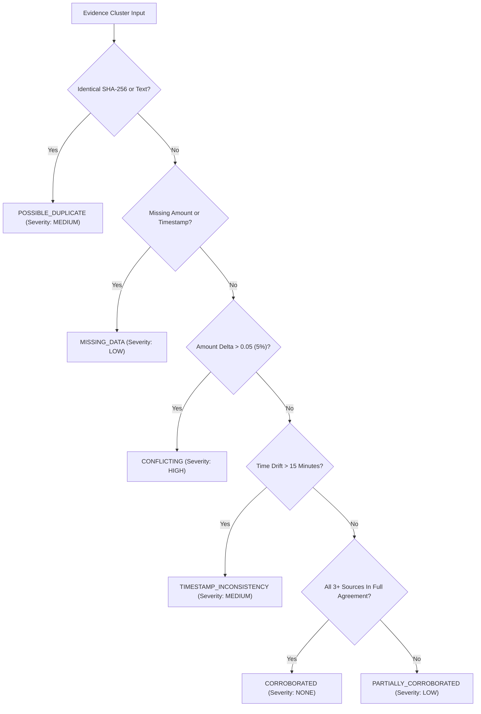

# FraudTrace AI — Contradiction Detection Engine

> **CRITICAL FORENSIC DISCLAIMER: SYNTHETIC DATA ONLY**  
> Contradiction detection isolates discrepancies between evidence sources for forensic investigators. It does not declare an individual dishonest, fraudulent, or guilty.

---

## 1. Engine Objective

In forensic investigations, evidence originates from conflicting, desynchronized, or human-reported sources:
- A victim's recollection may state they transferred ₹50,000.
- A core banking switch log records an IMPS debit of ₹48,000 (e.g. ₹2,000 bank convenience charge or user rounding).
- An SMS gateway timestamp may lag behind server UTC time by several minutes due to queue latency.

The **Contradiction Detection Engine** identifies these discrepancies with mathematical precision, categorizes their severity, explains the root cause, and caps confidence to avoid misleading investigators.

---

## 2. Contradiction Taxonomy & Detection Logic

### 1. Amount Contradiction (`CONFLICTING`)
- **Trigger**: Relative delta `abs(a1 - a2) / max(a1, a2) > 0.05` (5% threshold) or absolute delta exceeding ₹500.
- **Severity**: `HIGH`
- **Forensic Consequence**: Triggers immediate confidence cap (`score <= 0.40`). Both original amounts are preserved side-by-side in the timeline.

### 2. Timestamp Drift (`TIMESTAMP_INCONSISTENCY`)
- **Trigger**: Temporal drift between evidence items exceeds 15 minutes (900 seconds) while amounts and entities match.
- **Severity**: `MEDIUM`
- **Forensic Consequence**: Flagged as a clock synchronization anomaly (common in mobile screenshots vs NTP banking logs).

### 3. Missing Critical Data (`MISSING_DATA`)
- **Trigger**: One or more evidence items lack an verifiable timestamp or monetary amount.
- **Severity**: `LOW`
- **Forensic Consequence**: Evidence is retained but flagged; confidence is penalized due to lack of verifiable metadata.

### 4. Duplicate Evidence (`POSSIBLE_DUPLICATE`)
- **Trigger**: Two evidence items share an identical cryptographic SHA-256 hash or identical normalized text narrative.
- **Severity**: `MEDIUM`
- **Forensic Consequence**: The second record is marked as duplicate. It is **suppressed from the independent corroboration count** so that duplicate copies cannot artificially inflate evidentiary certainty.

### 5. Multi-Source Corroboration (`CORROBORATED`)
- **Trigger**: Two or more independent source classifications (e.g. Bank Statement + SMS Alert + Merchant POS) agree on amount (<1% delta) and timestamp (<5 minutes drift).
- **Severity**: `NONE`
- **Forensic Consequence**: Confidence is elevated to `HIGH` or `VERY HIGH`.

---

## 3. Hybrid Architecture: Rules + Machine Learning

The contradiction engine utilizes a dual-layer architecture:

| Capability | Deterministic Rule Layer | Machine Learning Layer (Random Forest) |
| :--- | :--- | :--- |
| **Duplicate Detection** | Exact cryptographic SHA-256 match | Text embedding cosine similarity |
| **Amount Discrepancy** | Exact numerical delta & ratio calculation | Multi-feature risk scoring |
| **Timestamp Drift** | Unix epoch delta in seconds | Non-linear interaction between time gap and source type |
| **Speed & Auditability** | Sub-millisecond execution, 100% explainable | Robust against noisy real-world permutations |
| **Safety Invariants** | Immutable hard guardrails | Feature weighting across 14 dimensions |

The deterministic layer acts as a **safety supervisor**. Even if a machine learning model produces a false positive or negative, the deterministic rule layer enforces strict forensic invariants (e.g. capping confidence whenever monetary discrepancy is detected).
