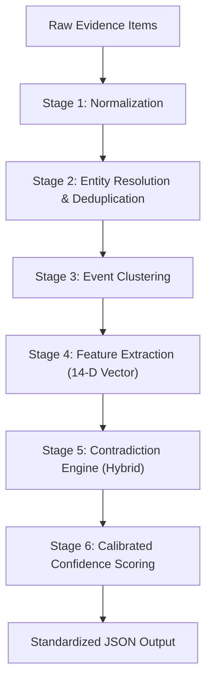

# FraudTrace AI — Machine Learning Pipeline Architecture

> **CRITICAL FORENSIC DISCLAIMER: SYNTHETIC DATA ONLY**  
> All data referenced in this pipeline is synthetic. The pipeline correlates evidence and flags contradictions; it does not determine legal culpability.

---

## 1. End-to-End Forensic Data Flow

The `ForensicInferencePipeline` executes in 6 sequential stages:



### Stage 1: Forensic Normalization
- **Phone Numbers**: Converted to E.164 canonical format (e.g. `+91 98765-43210` -> `9876543210`).
- **Monetary Amounts**: Stripped of symbols (`₹`, `Rs.`, `INR`, commas) and cast to standard floats.
- **Timestamps**: Parsed to ISO-8601 UTC with microsecond normalization.
- **Metadata**: Content hashes (SHA-256) computed to detect byte-identical duplicate files.

### Stage 2: Entity Resolution & Deduplication
- **Deduplication**: Evidence items sharing identical SHA-256 hashes or normalized text strings are flagged with `POSSIBLE_DUPLICATE` and collapsed to prevent artificial corroboration inflation.
- **Entity Matching**: Phone, UPI, bank account numbers, and person names are mapped into resolved cluster identifiers using exact canonical matching and Levenshtein token similarity.

### Stage 3: Event Clustering
- Groups evidence items into reconstructed events based on a sliding temporal window (default: 60 minutes) and amount proximity (default: 10% tolerance).
- **Core Principle**: Each evidence source retains its own distinct record. The system never overwrites complainant statements with bank logs or vice versa.

### Stage 4: 14-Dimensional Pairwise Feature Vector

| Index | Feature Name | Type | Description |
| :---: | :--- | :---: | :--- |
| 1 | `amount_exact_match` | Binary (0/1) | Whether amounts match within 0.01 precision |
| 2 | `amount_delta_ratio` | Float (0.0+) | Relative percentage difference: `abs(a1 - a2) / max(a1, a2)` |
| 3 | `amount_abs_diff` | Float (0.0+) | Absolute monetary difference in INR |
| 4 | `time_drift_seconds` | Float (0.0+) | Temporal gap in seconds |
| 5 | `time_within_15min` | Binary (0/1) | Whether time gap is <= 900 seconds |
| 6 | `time_within_1hour` | Binary (0/1) | Whether time gap is <= 3600 seconds |
| 7 | `time_within_24hours` | Binary (0/1) | Whether time gap is <= 86400 seconds |
| 8 | `same_source_type` | Binary (0/1) | Whether sources share the same classification |
| 9 | `independent_sources` | Binary (0/1) | Whether sources originate from independent systems |
| 10 | `entity_overlap_count`| Integer (0+) | Number of shared resolved entities |
| 11 | `entity_overlap_ratio`| Float (0-1) | Jaccard index of entity sets |
| 12 | `text_levenshtein_sim`| Float (0-1) | Normalized edit similarity of narrative texts |
| 13 | `text_token_jaccard` | Float (0-1) | Word token overlap ratio |
| 14 | `has_missing_critical_data`| Binary (0/1)| Flag indicating missing timestamp or amount |

### Stage 5: Hybrid Contradiction Arbiter
- Combines the deterministic **Forensic Rulebook** (for strict invariant enforcement like identical hashes or large monetary deltas) with a **Random Forest Classifier** (trained on synthetic multi-incident pairwise features).
- Produces one of 6 contradiction statuses:
  - `CORROBORATED`
  - `CONFLICTING`
  - `PARTIALLY_CORROBORATED`
  - `MISSING_DATA`
  - `TIMESTAMP_INCONSISTENCY`
  - `POSSIBLE_DUPLICATE`

### Stage 6: Calibrated Confidence Scoring & Guardrails
- Implements the official confidence formula:
  $$\text{Base Score} = \text{corroboration\_count} \times \text{weight} + \text{independence\_bonus}$$
- Applies the **Mandatory Conflict Cap**:
  $$\text{If } \text{status} == \text{CONFLICTING} \implies \text{Confidence} \le 0.40$$

---

## 2. Standardized Section 7 Output Schema

Every invocation of `analyze_event()` produces the following JSON structure:

```json
{
  "event_id": "EV-REC-20240315-001",
  "evidence_count": 2,
  "sources_analyzed": [
    {"id": "EV-FIR-1", "type": "POLICE_COMPLAINT", "source": "Victim FIR"},
    {"id": "EV-BANK-2", "type": "BANK_STATEMENT", "source": "HDFC Core"}
  ],
  "contradiction": {
    "status": "CONFLICTING",
    "severity": "HIGH",
    "is_contradictory": true,
    "confidence_cap_applied": true,
    "explanation": "Amount mismatch detected across 2 sources: Rs. 50,000.0 vs Rs. 48,000.0 (Delta: Rs. 2,000.0 / 4.0%)"
  },
  "discrepancies": [
    {
      "field": "amount",
      "severity": "HIGH",
      "description": "Amount mismatch: Rs. 50,000.0 vs Rs. 48,000.0",
      "items": [
        {"evidence_id": "EV-FIR-1", "source": "Victim FIR", "value": 50000.0},
        {"evidence_id": "EV-BANK-2", "source": "HDFC Core", "value": 48000.0}
      ]
    }
  ],
  "confidence": {
    "score": 0.25,
    "level": "LOW",
    "calibrated": true,
    "independent_sources": 2,
    "reasoning": "Confidence capped at LOW (0.25) due to high-severity factual contradiction between sources."
  },
  "entities_resolved": [
    {
      "type": "phone",
      "canonical_value": "9876543210",
      "source_occurrences": ["EV-FIR-1", "EV-BANK-2"],
      "match_confidence": 1.0
    }
  ],
  "reconstructed_timeline": [
    {
      "timestamp": "2024-03-15T10:30:00Z",
      "source": "Victim FIR",
      "amount": 50000.0,
      "event_type": "POLICE_COMPLAINT"
    },
    {
      "timestamp": "2024-03-15T10:32:00Z",
      "source": "HDFC Core",
      "amount": 48000.0,
      "event_type": "BANK_STATEMENT"
    }
  ]
}
```

---

## 3. High Availability & Graceful Fallback

In production:
1. The Node.js web backend attempts to connect to the FastAPI inference service at `http://localhost:8000/predict/analyze` with a 1500ms timeout.
2. If the FastAPI microservice is offline or restarting, the Node.js backend executes built-in deterministic fallback logic, ensuring **zero user downtime**.
